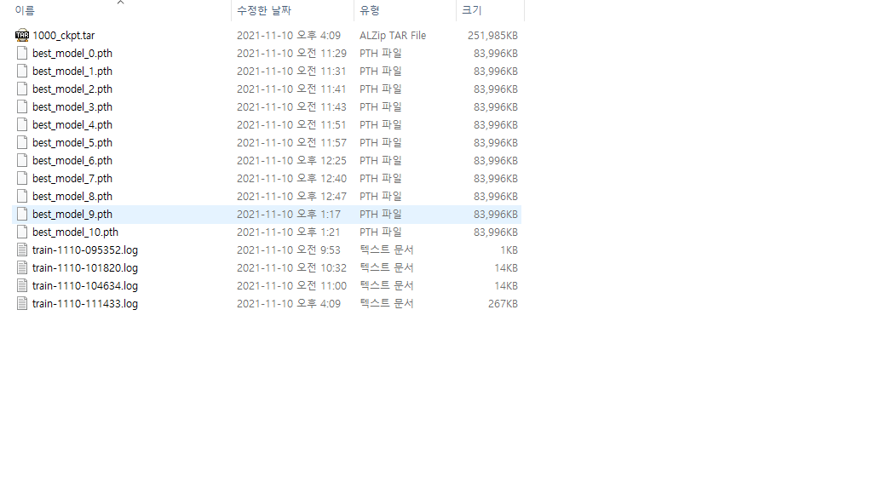

# dm_count

2021년 2학기 컴퓨터비전의 텀프로젝트 Distribution Matching for Crowd Counting 코드 원복 저장소 입니다.

## Env

본체 GPU RTX3090에 맞춰 torch와 torchvision을 설정한 뒤, 추가적인 라이브러리를 install 했습니다.

## Process
train -> val 로 진행하며, 최종 val을 통해 result 폴더의 submission.csv를 리더보드에 제출했습니다.
test와 val에 사용하는 모델은 train을 통해 발생한 best_model.pth입니다. 

## Model
저장된 모델은 아래 사진과 같이 local에 적재되었습니다.

